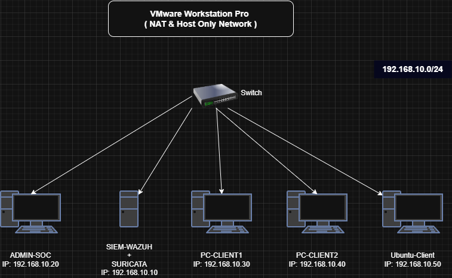
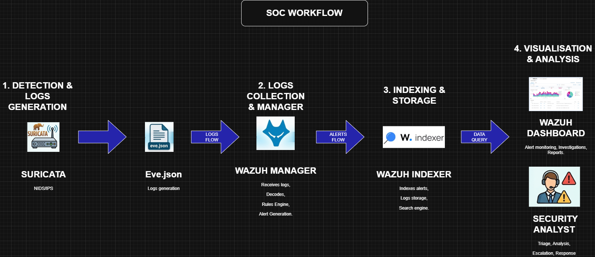
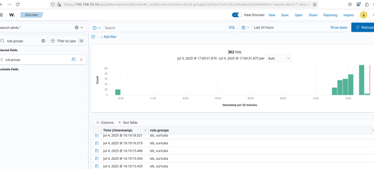
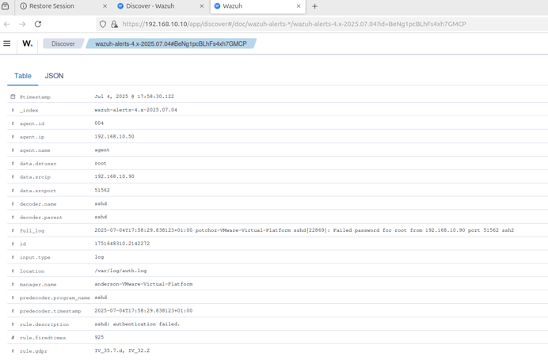
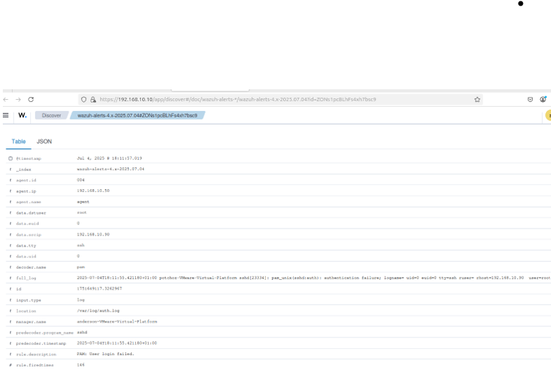
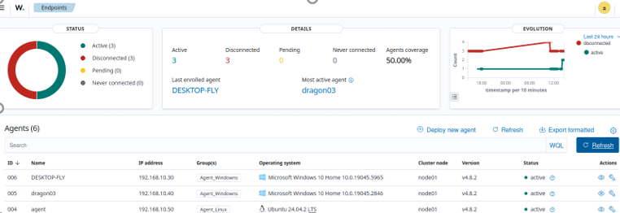

<div align="center">

# 🛡️ SOC Lab — Wazuh & Suricata

<!-- Les Badges avec icônes officielles -->


<p align="center">
  <b>Real-time threat detection and centralized log monitoring environment.</b>
</p>

---

</div>

## 📌 Project Overview

This project documents the implementation of a complete Security Operations Center (SOC) lab using **Wazuh** as the centralized SIEM solution and **Suricata** for network intrusion detection (IDS).

The environment was designed to simulate a small enterprise infrastructure where security monitoring, attack detection, log analysis, and incident investigation can be performed in real time.

The SOC infrastructure integrates:

- Wazuh SIEM
- Suricata IDS
- VMware virtualized infrastructure
- Windows and Linux monitored endpoints
- Attack simulation scenarios for threat detection testing



---

## Why This Project

Small and medium-sized businesses often lack centralized security monitoring and intrusion detection capabilities.

This project was designed to demonstrate how an open-source SOC solution can improve visibility, threat detection, and incident response within a virtual enterprise environment.

---

## Objectives

- Centralize logs from multiple endpoints
- Detect suspicious activities in real time
- Monitor network traffic
- Simulate cyber attacks
- Improve visibility across the infrastructure
- Analyze alerts through a centralized dashboard

---

## Lab Architecture

The SOC lab consists of five interconnected virtual machines deployed in VMware Workstation.

| Machine | Operating System | Role |
|---|---|---|
| SIEM-WAZUH | Ubuntu 24.04 | Wazuh Server + Suricata |
| Admin_SOC | Ubuntu 24.04 | SOC Administration |
| PC-Client1 | Windows 10 | Monitored Endpoint |
| PC-Client2 | Windows 10 | Monitored Endpoint |
| Ubuntu-Client | Ubuntu 24.04 | Monitored Endpoint |


---

## Detection Workflow

1. Network traffic is monitored by Suricata
2. Suricata generates JSON alerts in eve.json
3. Wazuh ingests and analyzes the logs
4. Security events are indexed in OpenSearch
5. Alerts are visualized in the Wazuh Dashboard
6. Analysts can investigate suspicious activities in real time



---

## Technologies Used

### SIEM & Monitoring
- Wazuh
- OpenSearch
- Wazuh Dashboard

### IDS
- Suricata

### Virtualization
- VMware Workstation Pro

### Operating Systems
- Ubuntu 24.04
- Windows 10

### Networking
- TCP/IP
- NAT Networking
- SSH

---

## Features

- Centralized log management
- Real-time alerting
- Network intrusion detection
- Endpoint monitoring
- Attack simulation and detection
- Dashboard visualization
- Multi-platform endpoint monitoring

---

## Detection Capabilities

The SOC environment is capable of detecting:

- Network reconnaissance activity
- SSH brute-force attacks
- ICMP flood activity
- Suspicious authentication attempts
- Unauthorized network scanning
- Abnormal traffic behavior

---

## Log Sources

The SOC collects and analyzes logs from:

- Windows Event Logs
- Linux Syslogs
- Suricata IDS alerts
- Authentication logs
- Network traffic events

---

## Skills Demonstrated

- SIEM Deployment
- IDS Configuration
- Security Monitoring
- Threat Detection
- Log Analysis
- Attack Simulation
- Incident Investigation
- Linux Administration
- Network Security Monitoring

---

## Attack Simulations

The following attacks were simulated and successfully detected by the SOC environment:

| Attack Type | Detection Tool | Result |
|---|---|---|
| Nmap Scan | Suricata + Wazuh | Detected |
| SSH Brute Force | Wazuh | Critical Alert |
| ICMP Flood | Suricata | Detected |

---

### Nmap Detection



---

### SSH Brute Force Alert



---

### ICMP Flood Detection



---

## Wazuh Dashboard

The Wazuh Dashboard provides centralized visibility into security events, endpoint monitoring, and intrusion alerts.



---

## Project Structure

```text
wazuh-soc-lab/
├── architecture/
├── screenshots/
├── configs/
├── attack-simulations/
├── docs/
└── scripts/
```

---

## Future Improvements

- Integration with TheHive
- Automated incident response
- Threat intelligence feeds
- Email alerting
- Active response automation
- Advanced detection rules
- Cloud monitoring integration

---

## Author

Anderson MEH BELLA

Cybersecurity Analyst | SOC • Offensive & Defensive Security • Cloud | AI-Driven Cybersecurity

- LinkedIn: www.linkedin.com/in/anderson-meh-bella
- GitHub: github.com/AndersonMehBella
